# FIFOZ — Application Interface & Data-Flow Design Specification (v2.1)

**Version**: 2.1  
**Generated**: 2026-06-04  
**Supersedes**: `design-spec-app-interfaces-m15-spine-v2.md` (v2)  
**Audit**: audit-069 (round 2); prior audit-068  
**App version**: 2.0.1 (M15.1 remediation)  
**Scope**: UI screens, Zustand stores, client calculation engines, Firestore persistence, FastAPI backend, and cross-feature data relationships  
**Related**: M15, M15.1, audit-046, audit-063, audit-068, audit-069  
**Audience**: Detail design, QA matrix authors, staging device sign-off (task-177)  
**Standards mapping**: arc42 §3–8, C4 L1–L3, IEEE 1016 interface/runtime views, DFD levels 0–2

### Changelog (v2 → v2.1)

| Change | Section |
|--------|---------|
| task-174 / `paytracker.test.tsx` marked fixed (12 Jest cases) | §10.2, §15 |
| task-175 Classic removal + milestone meta sync marked fixed | §10.2 |
| M16 health PG reference corrected (PG-08, not PG-06–09) | §16 |
| Visualizer rendering notes updated to v1.5.3 | §19 |
| File index adds audit-069 and v2.1 self-reference | §18 |

### Changelog (v1 → v2)

| Change | Section |
|--------|---------|
| Removed duplicate `goalsStore` row; added `uiPreferencesStore`, `authSession`, `uidScopedStorage` | §5 |
| Documented tab re-export navigation pattern | §4.3 |
| Documented roster write vs read dual path | §5.2 |
| Added pay loop, sign-out, tab shell, goals sync flowcharts | §4.3, §5.3, §7.2, §12 |
| Corrected `configuredDomains` truth conditions (roster mirror, payModel) | §14 |
| Flagged sign-out `clearModel()` Firestore delete (CO-285) | §12.1, §15 |
| PG traceability status column (fixed / partial / open) | §11 |
| task-174/175 status caveats per audit-063 | §10.2 |
| Reordered file index before Mermaid notes; updated Visualizer fix | §18, §19 |
| Normalized paths to `frontend/store/` | throughout |

> **Viewing diagrams (ACP Visualizer Docs tab):** Click any diagram to zoom full-screen, or use the **⛶ fullscreen** button. If a block shows “Diagram rendering failed”, check §19. Visualizer ≥ `fad4492` fixes stale NodeList / `data-processed` issues with Mermaid 11.

---

## 1. Executive summary

FIFOZ is structured as **layers of interfaces** that exchange data:

| Layer | Role |
|-------|------|
| **Screens** (Expo Router) | User-facing features (F1–F10 PRD) |
| **Stores** (Zustand v5, `frontend/store/`) | Session state, Firestore subscriptions, orchestration |
| **Client engines** (`frontend/calculations/`) | Offline ATO wages, leave, roster math |
| **Firestore** | Authoritative user data (uid-scoped, field-encrypted where sensitive) |
| **Backend** (FastAPI / Cloud Run) | Employment timeline, goals CRUD, payslip OCR (Gemini), legacy REST mirrors |
| **Platform** | Firebase Auth, RevenueCat, EAS env, device encryption key |

**Before M15 (v1.5.x):** Features were **silos** — wages re-typed each visit, pay tracker ignored wage estimates, roster lived in two stores, profile APIs unused in UI, home KPIs were snapshots only.

**After M15 + M15.1 (v2.0.0 → v2.0.1):** A **companion spine** connects pay model, roster, profile, tracker, calendar, goals, and home through shared stores and explicit data flows. Residual dual paths (REST roster helpers, employment via API only) and one sign-out defect (CO-285) remain documented as technical debt.

---

## 2. Terminology

| Term | Meaning in this document |
|------|---------------------------|
| **Interface** | Any bounded surface: screen route, store API, REST endpoint, Firestore path, or calculation module |
| **Spine** | M15 cross-feature wiring: wage model ↔ roster ↔ profile ↔ pay records ↔ home/goals |
| **Snapshot** | Denormalized KPI cache in `homeDashboardStore` (not source of truth) |
| **Source of truth** | Firestore document/subcollection or encrypted wage model doc |
| **Dual path** | Same domain reachable via Firestore **and** REST (legacy — being retired) |
| **Mirror** | Denormalized copy in `calendarStore` populated from `rosterStore` via `rosterMirror` |
| **Re-export tab** | `(tabs)/foo.tsx` that re-exports `../foo.tsx` so stack and tab routes share one screen |

---

## 3. System context (post-M15)

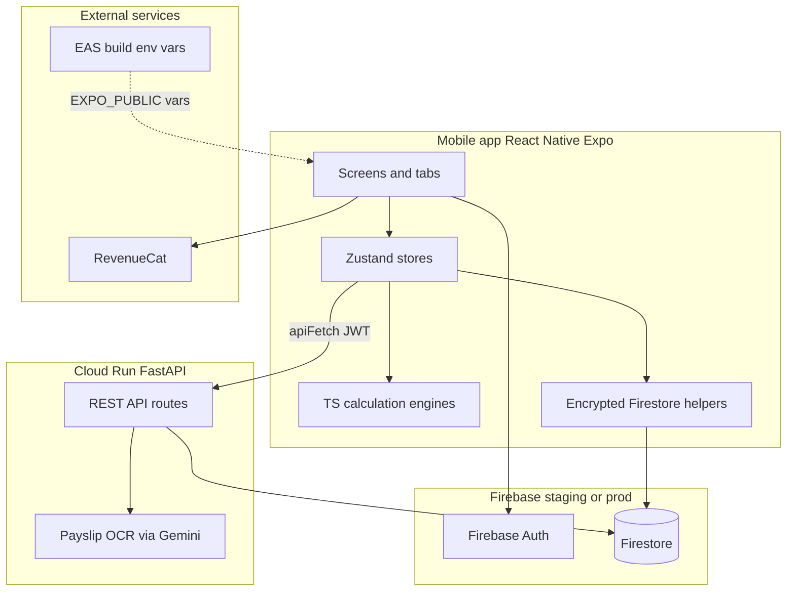

**Verified**: Matches `frontend/app/_layout.tsx` bootstrap, `apiFetch` JWT pattern, and RevenueCat integration.

---

## 4. Interface inventory — screens (presentation)

### 4.1 Tab shell (configurable)

Middle tabs are user-configurable via `tabPreferencesStore`. **Home** and **More** are fixed anchors.

| Route | Screen | PRD | Primary store(s) | Data source (post-M15) |
|-------|--------|-----|------------------|------------------------|
| `(tabs)/index` | Home — Modern dashboard | — | `homeDashboardStore`, `rosterStore`, `configuredDomains` | Snapshots + live roster |
| `(tabs)/calendar` | Calendar month | F1 | `calendarStore`, `rosterStore` | Events FS + mirrored roster |
| `(tabs)/roster` | Roster patterns | F2 | `rosterStore` | Firestore `rosterPatterns` |
| `(tabs)/wages` | Wage & tax calculator | F3 | `wageModelStore`, `financeStore`, `rosterStore` | Encrypted `wageModel` + on-device calc |
| `(tabs)/leave` | Leave entitlements | F4 | `financeStore`, `homeDashboardStore` | On-device `leave.ts` + employment API |
| `(tabs)/paytracker` | Pay records | F5 | `financeStore`, `wageModelStore`, `goalsStore`, `homeDashboardStore` | Firestore `payRecords` + OCR API |
| `(tabs)/goals` | Savings goals | F6 | `goalsStore`, `wageModelStore` | API + Firestore listener |
| `(tabs)/health` | Health library | F7 | Local / premium gate | AsyncStorage + static content |
| `(tabs)/backup` | Backup export/import | F9 | `backupStore` | `.fifoz` encrypted file |
| `(tabs)/more` | More / settings hub | — | Navigation only | — |

### 4.2 Stack routes (non-tab)

| Route | Purpose | Stores / APIs |
|-------|---------|---------------|
| `profile.tsx` | Employment history UI | `/api/employment/*` |
| `roster-history.tsx` | Roster change log | `rosterStore.rosterChanges` |
| `calendar-week.tsx`, `calendar-day.tsx` | Calendar views | `calendarStore`, `rosterStore` |
| `event-form.tsx` | Personal events | `calendarStore` → Firestore `events` |
| `login.tsx`, `register.tsx` | Auth | `authStore` |
| `pin-setup.tsx`, `settings-app-lock.tsx` | App lock | `pinStore` |
| `transfer.tsx` | QR device transfer | `backupStore`, crypto |
| `paywall.tsx` | Premium | `subscriptionStore`, RevenueCat |
| `onboarding/*` | Disclosure, backup password | AsyncStorage flags |
| `(developer)/*` | Rate inspector, compliance | Dev-only |

### 4.3 Tab re-export pattern (navigation architecture)

Heavy screens live at **stack routes** (`frontend/app/wages.tsx`, `paytracker.tsx`, etc.). Tab files are thin re-exports so the tab bar stays visible without duplicating screen logic.

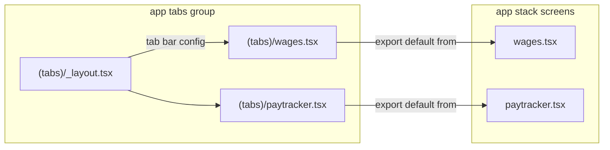

**Example** (`frontend/app/(tabs)/wages.tsx`):

```typescript
export { default } from '../wages';
```

**Implication**: Deep links and tests may target either `(tabs)/wages` or `/wages`; both render the same component.

### 4.4 Pre-M15 vs post-M15 — screen behaviour

| Screen | Pre-M15 | Post-M15 / M15.1 |
|--------|---------|------------------|
| **Wages** | Local React state; lost on leave; `POST /api/calculate/wages` | `wageModelStore` persisted encrypted; **on-device** `calculateForYear()` |
| **Pay Tracker** | Manual estimates; REST create path; listener unused | Prefill from `wageModelStore`; `financeStore.createPayRecord` → encrypted FS; OCR `/api/pay-records/ocr` |
| **Leave** | Profile `start_date` only | `fetchCurrentEmployment()` → service years; saves profile to FS on calculate |
| **Roster** | Mixed `calendarStore` REST + UI state | `rosterStore` Firestore CRUD; active pattern on user doc |
| **Calendar** | Roster patterns from calendar subscription | `mirrorRosterToCalendar()` from `rosterStore` (tabs `_layout`) |
| **Home** | Classic + Modern; weak setup signal | Modern only (M15.1); 7 setup domains; `NextActionChip`, affordability |
| **Goals** | Disconnected from net pay | `GoalsAffordabilityBar` uses wage model net; check-in after pay |

---

## 5. Interface inventory — state stores

All stores live under `frontend/store/`. The barrel `frontend/store/index.ts` re-exports seven stores; others are imported directly.

| Store | File | Persistence | Subscribes / writes Firestore | Backend REST |
|-------|------|-------------|------------------------------|--------------|
| `authStore` | `authStore.ts` | Session | User doc reads on bootstrap | — |
| `authSession` | `authSession.ts` | Module singleton | uid for scoped storage | — |
| `wageModelStore` | `wageModelStore.ts` | Encrypted FS | `users/{uid}/wageModel/current` | — (calc on device) |
| `financeStore` | `financeStore.ts` | Memory + FS | User profile doc, `payRecords` | Employment (indirect), deprecated profile REST |
| `rosterStore` | `rosterStore.ts` | Persist + FS | `rosterPatterns`, `rosterChanges`, `active_roster_pattern_id` | Deprecated via calendarStore |
| `calendarStore` | `calendarStore.ts` | Memory + FS | `events` listener | Deprecated roster REST helpers |
| `goalsStore` | `goalsStore.ts` | Memory + FS | `savingsGoals` listener | Goals CRUD via `apiFetch` |
| `homeDashboardStore` | `homeDashboardStore.ts` | uid-scoped AsyncStorage | — (snapshots only) | — |
| `backupStore` | `backupStore.ts` | — | Export all subcollections | — |
| `pinStore` | `pinStore.ts` | Secure / persist | — | — |
| `themeStore` | `themeStore.ts` | AsyncStorage | — | — |
| `tabPreferencesStore` | `tabPreferencesStore.ts` | Persist | — | — |
| `uiPreferencesStore` | `uiPreferencesStore.ts` | Persist | — | — |
| `subscriptionStore` | `subscriptionStore.ts` | Memory | — | RevenueCat |
| `uidScopedStorage` | `uidScopedStorage.ts` | AsyncStorage adapter | Per-uid key prefix | — |

### 5.1 Store relationship diagram (post-M15 spine)

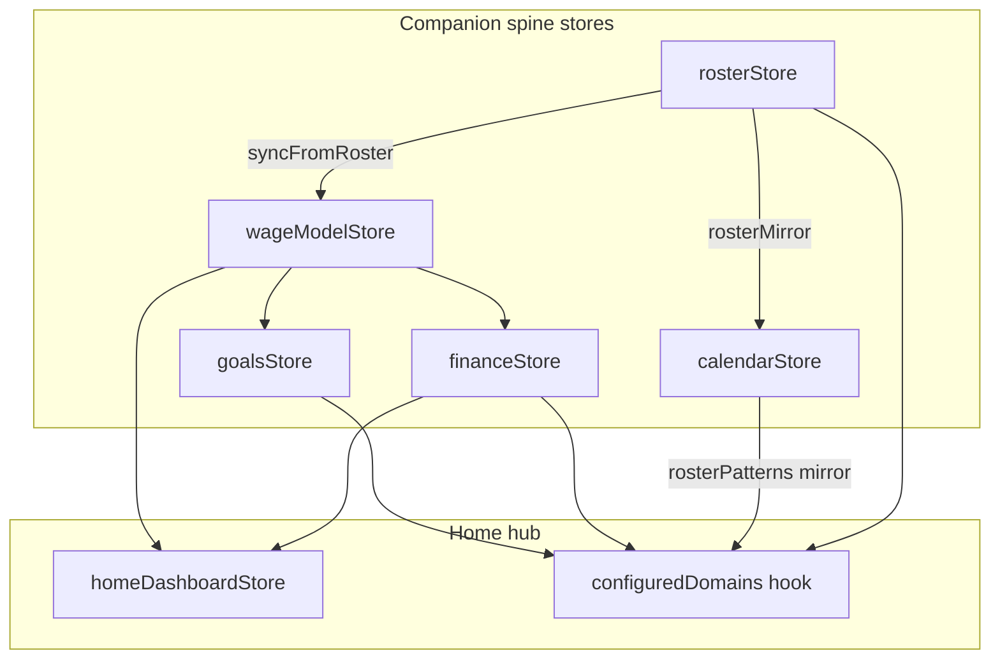

### 5.2 Roster authority — write vs read paths

**Write authority**: `rosterStore` only (Firestore CRUD, `active_roster_pattern_id` on user doc).

**Read paths** split by consumer:

| Consumer | Roster data source | Notes |
|----------|-------------------|-------|
| Roster screen | `rosterStore` | Authoritative patterns |
| Calendar views | `calendarStore` mirror | `mirrorRosterToCalendar()` in tabs `_layout` |
| Home phase / NextActionChip | `rosterStore` + `calendarStore` | Phase from roster; chip may use both |
| Setup banner `roster` domain | `calendarStore.rosterPatterns` + `rosterStore.activePatternId` | Mirror must be warm before banner is accurate |

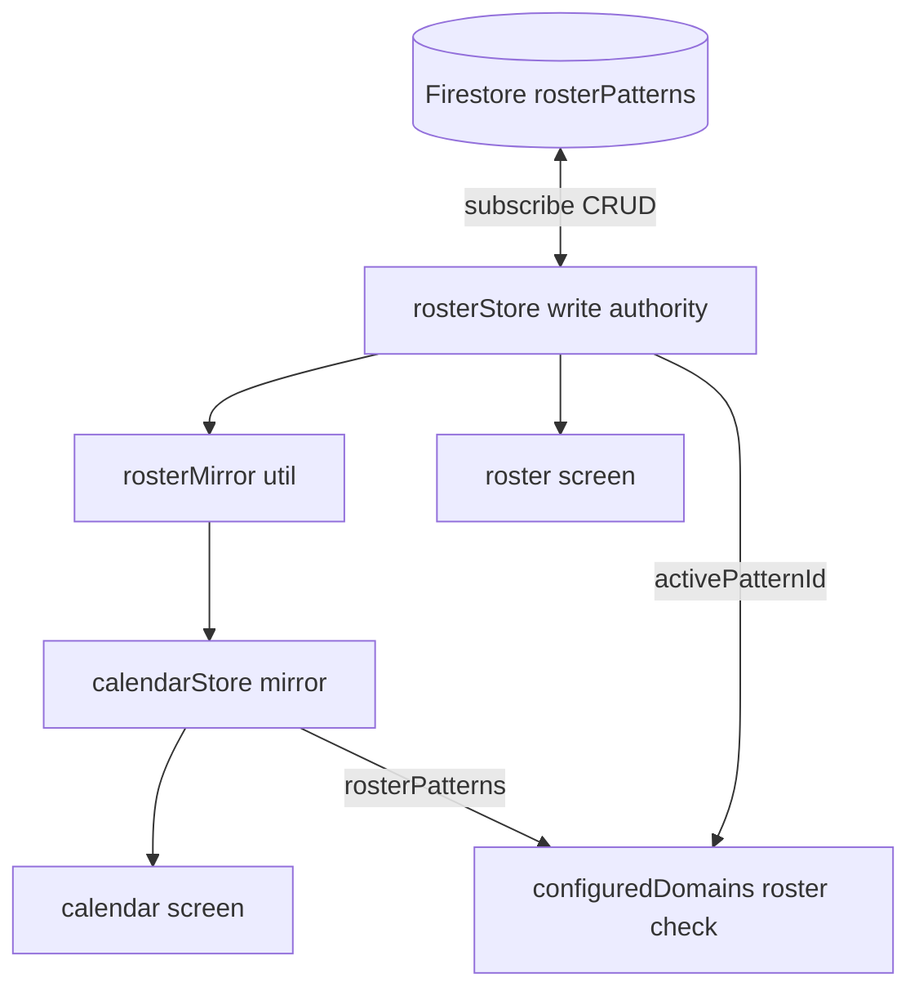

### 5.3 Goals sync — REST write + Firestore listener

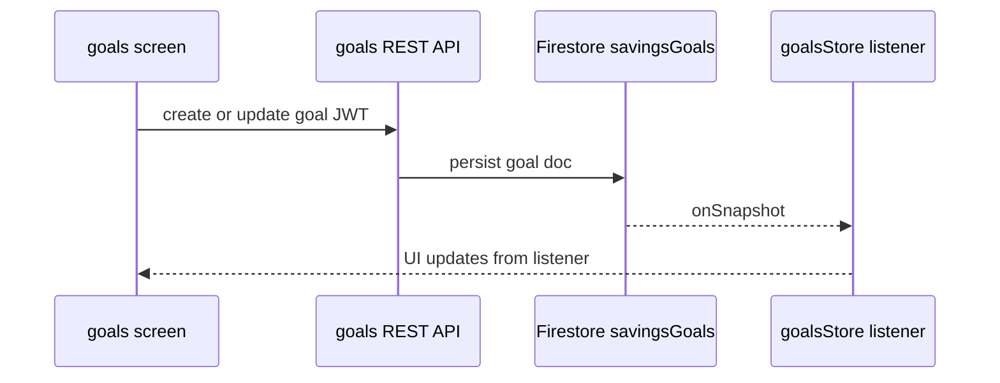

Mutations go through REST; UI refresh is driven by the Firestore listener (unchanged pre/post M15 pattern).

### 5.4 Auth orchestration edges

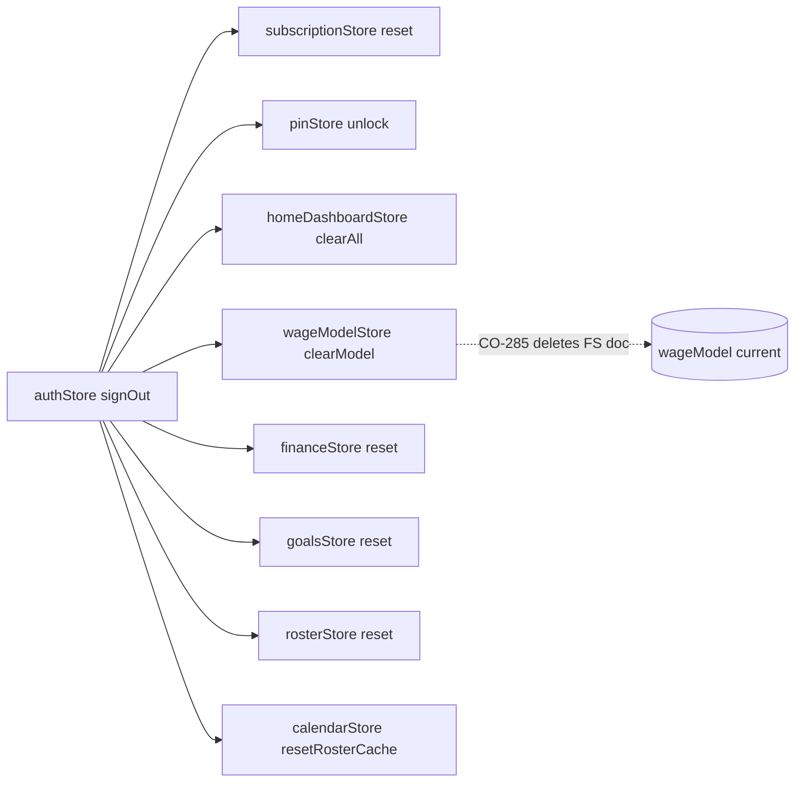

---

## 6. Firestore interface map

**Root pattern:** `users/{uid}/…` — enforced in `firebase/firestore.rules`.

| Path | Interface type | Encryption | Written by | Read by |
|------|----------------|------------|------------|---------|
| `users/{uid}` | User profile doc | Selected fields AES-GCM | `financeStore.saveProfileToFirestore` | `financeStore.loadProfileFromFirestore`, wages, leave |
| `users/{uid}/wageModel/current` | Wage model (doc id `current`) | Full doc encrypted | `wageModelStore` | wages, paytracker, goals affordability |
| `users/{uid}/rosterPatterns/{id}` | Roster patterns | Plain | `rosterStore` | roster, calendar mirror, wage prefill |
| `users/{uid}/rosterChanges/{id}` | Pattern history | Plain | `rosterStore` | roster-history |
| `users/{uid}/events/{id}` | Personal events | Plain | `calendarStore` | calendar views |
| `users/{uid}/payRecords/{id}` | Pay records | Amount fields encrypted | `financeStore.createPayRecord` | paytracker, home tracker snapshot |
| `users/{uid}/savingsGoals/{id}` | Goals | Plain (amounts) | API → sync | goals, home |
| `users/{uid}/payCycles/{id}` | Goal cycles | Plain | API | goals |
| `users/{uid}/employmentHistory/{id}` | Employment | Plain | Backend API | profile (UI) |
| `users/{uid}/backup/{id}` | Backup metadata | — | backup flow | backup |

**Constant:** `USER_FIRESTORE_SUBCOLLECTIONS` in `frontend/constants/userFirestoreCollections.ts`.

### 6.1 Pre-M15 vs post-M15 — persistence

| Domain | Pre-M15 | Post-M15 |
|--------|---------|----------|
| Wage inputs | None (ephemeral UI) | `wageModel/current` encrypted |
| Pay records | REST + partial listener confusion | Single path: `financeStore` encrypted writes |
| Roster | Split calendar vs roster stores | `rosterStore` authoritative; calendar mirrored |
| Profile | `/api/profile` unused in UI | Firestore user doc + employment API for leave |
| Goals | REST primary | REST + Firestore listener |

---

## 7. Backend API interface catalog

**Base:** `{EXPO_PUBLIC_BACKEND_URL}/api` — JWT required except `/health`.

| Group | Endpoints | Used by (post-M15) | Notes |
|-------|-----------|-------------------|--------|
| **Health** | `GET /health` | CI, staging verify | No auth |
| **Events** | CRUD `/events`, iCal export | Legacy / dev; personal events prefer FS | uid-scoped |
| **Roster patterns** | CRUD, day-info, calendar-range, generate | **Deprecated in app UI**; migration read only | Prefer `rosterStore` |
| **Calculations** | `POST /calculate/wages`, `/tax`, `/leave` | Dev tools; wages UI uses **client** engine | Backend uses `ato_library.py` |
| **Tax info** | `GET /tax-info`, `/tax-rates/current`, `/states` | leave.tsx states list | |
| **Profile** | `GET/POST /profile` | **Deprecated** — use Firestore | |
| **Employment** | CRUD `/employment`, `/current`, `/service-summary` | `profile.tsx`, `leave.tsx` sync | Spine Phase A (task-170) |
| **Roster changes** | CRUD `/roster-changes` | Optional; store uses FS | |
| **Pay records** | CRUD `/pay-records`, summary, **`POST /pay-records/ocr`** | OCR from paytracker; CRUD via FS | Gemini key on server |
| **Goals** | Full goals + cycles API | `goalsStore` | ~20 routes |

### 7.1 Data flow — payslip OCR (M15.1 task-172)

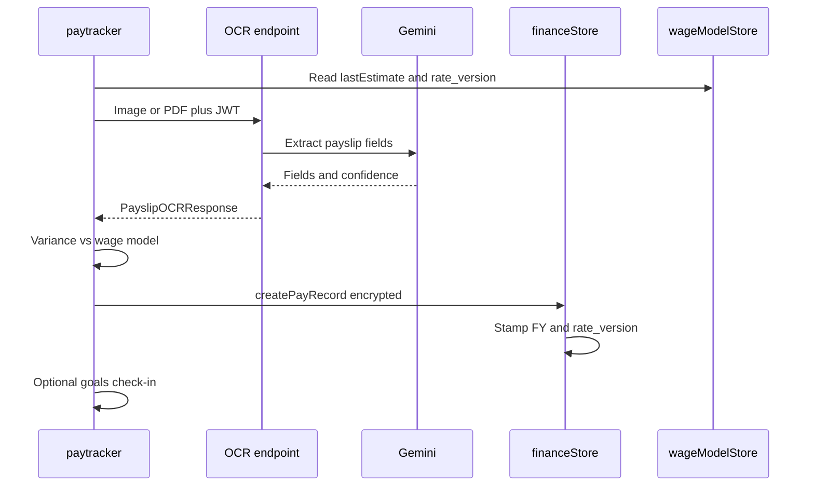

### 7.2 Data flow — periodic pay loop (end-to-end)

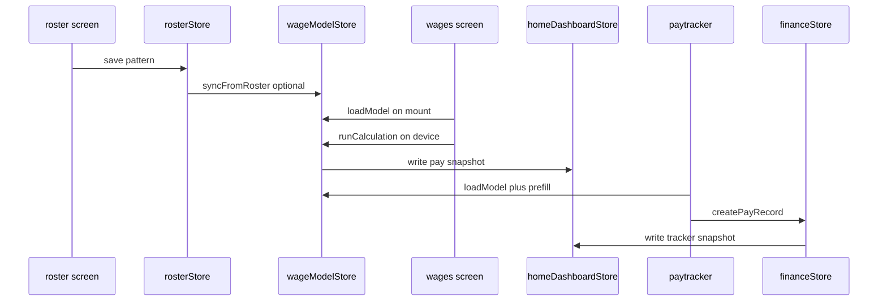

---

## 8. Client calculation engines (offline interfaces)

| Module | Path | Inputs | Outputs | Consumers |
|--------|------|--------|---------|-----------|
| `wages.ts` | `calculations/wages.ts` | `WageCalculationInput` | `WageBreakdown` | `wageModelStore.runCalculation` |
| `ato/*` | `calculations/ato/` | Financial year registry | Rates, LITO, HECS, MLS | wages, backend parity tests |
| `leave.ts` | `calculations/leave.ts` | State, service years, employment type | `LeaveEntitlements` | leave screen via store wrapper |
| `roster.ts` | `calculations/roster.ts` | Pattern, date range | Day info, phases | calendar, home, roster |
| `recurrence.ts` | `calculations/recurrence.ts` | Event rules | Occurrence expansion | calendar |

**M15 Phase A:** FY **2025–26** (`rates.2025-26.ts`) and **2026–27** (`rates.2026-27.ts`) registered in `calculations/ato/index.ts`. `pay_date` / explicit year selects rate set.

---

## 9. Pre-M15 architecture — siloed interfaces

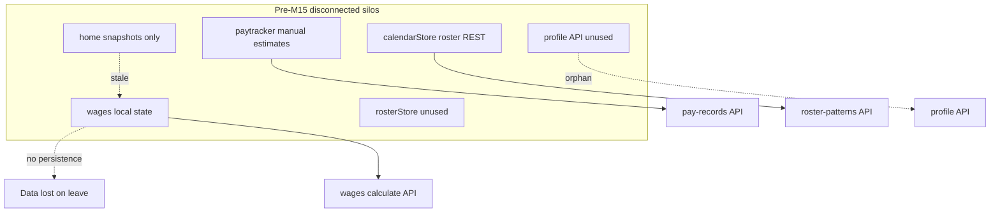

### 9.1 Pre-M15 gap register (audit-046)

| ID | Gap | Affected interfaces |
|----|-----|---------------------|
| PG-01 | No worker profile loop | wages ↔ financeStore |
| PG-02 | Pay loop broken | wages ↔ paytracker |
| PG-03 | Dual roster authority | calendarStore ↔ rosterStore |
| PG-04 | Pay tracker dual path | financeStore listener vs REST UI |
| PG-05 | Employment silo | profile API ↔ leave/wages |
| PG-06 | Wages on backend not device | wages ↔ calculations/ |
| PG-07 | Goals disconnected from pay | goals ↔ paytracker |
| PG-08 | Health not roster-aware | health ↔ calendar (M16 target) |
| PG-09 | Incomplete setup domains | home ↔ configuredDomains |
| PG-10 | Sign-out store hygiene | authStore ↔ all stores |

---

## 10. Post-M15 architecture — companion spine

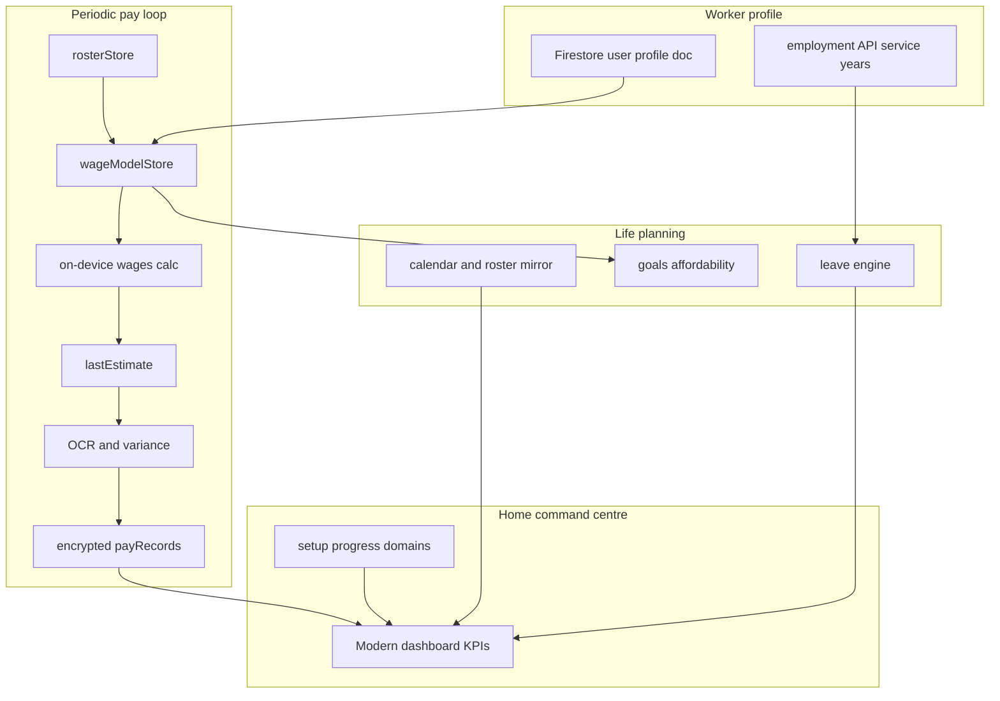

### 10.1 M15 deliverables → interfaces

| M15 phase | Tasks | Interfaces created / improved |
|-----------|-------|--------------------------------|
| **A — Pay model** | 118–124, 164 | `wageModelStore`, `calculations/ato/*`, encrypted `wageModel/current`, on-device wages UI |
| **A.5 — Audit-059** | 165–168 | Backend tax path unity, FE↔BE rate parity tests |
| **B — Profile** | 125–126 | `loadProfileFromFirestore` in `_layout`, save on wages/leave calculate |
| **C — Roster** | 127–129 | `rosterStore` in tabs `_layout`, `rosterMirror`, client roster event generation |
| **D — Pay tracker** | 130–132 | Encrypted `payRecords` only, FY stamps, sign-out clears stores |
| **E — Goals + home** | 133–139 | Affordability bar, setup domains, Classic removed (M15.1), QA matrix |

### 10.2 M15.1 remediation → additional interface changes

| Task | Interface impact | Status (audit-063) |
|------|------------------|-------------------|
| 169 | Single roster source; `resetRosterCache` on sign-out | ✅ fixed |
| 178 | `spineMigration.ts` one-time REST → FS migration | ✅ fixed |
| 170 | Leave ↔ employment API sync | ⚠️ partial — wages path open |
| 171 | Pay record metadata; deprecate REST profile | ✅ fixed |
| 172 | OCR tiers, offline queue, variance UI | ⚠️ partial — PDF via JSON base64 |
| 173 | `NextActionChip` payday, `payPeriodNormalize` | ✅ fixed |
| 174 | `paytracker.test.tsx` Jest contract | ✅ fixed — 12 tests (`frontend/__tests__/paytracker.test.tsx`) |
| 175 | Classic dashboard removal, milestone meta sync | ✅ fixed — `ClassicDashboard` removed; M15 meta completed/32 |
| 177 | Device QA gate (human) | ❌ open — unsigned |

---

## 11. Requirements traceability — product gaps → interfaces

| PG | Requirement | Post-M15 interface(s) | Status | Verification |
|----|-------------|----------------------|--------|--------------|
| PG-01 | Persist wage inputs | `wageModelStore` | **fixed** | Reopen wages → fields populated |
| PG-02 | Estimates → tracker | `payTrackerPrefillFromEstimate` | **fixed** | Add pay record pre-filled |
| PG-03 | Single roster | `rosterStore` + `mirrorRosterToCalendar` | **fixed** | Home phase = roster screen; setup uses mirror |
| PG-04 | Tracker integrity | `financeStore.createPayRecord` only | **fixed** | No direct `/api/pay-records` from UI |
| PG-05 | Employment → leave | `fetchCurrentEmployment`, service summary | **partial** | Leave years match profile; wages not synced |
| PG-06 | On-device wages | `wageModelStore.runCalculation` | **fixed** | Airplane mode wages tab |
| PG-07 | Goals on pay day | Check-in prompt post-record | **partial** | paytracker → goals optional prompt |
| PG-08 | Health roster-aware | — | **open** | M16 target |
| PG-09 | Affordability + setup | `GoalsAffordabilityBar`, `configuredDomains` | **fixed** | 7 domains; bar reflects net |
| PG-10 | Sign-out hygiene | `authStore.signOut` resets stores | **open** | CO-285: `clearModel` deletes FS wage doc; events/prefs may persist |

---

## 12. Bootstrap & session lifecycle

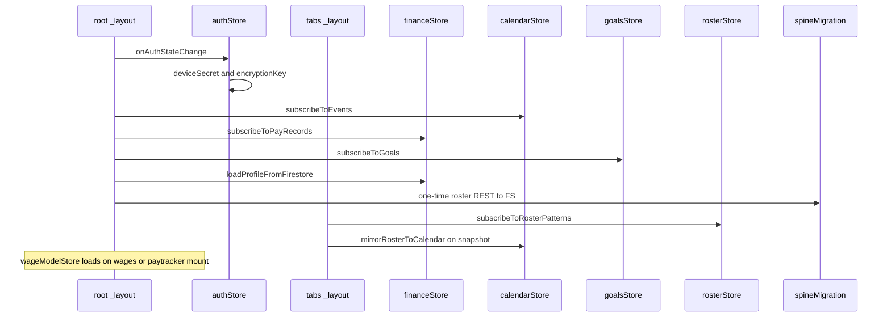

| Event | Interface actions |
|-------|-------------------|
| **Sign in** | Firebase Auth → encryption key → Firestore listeners (events, payRecords, goals, roster) |
| **Sign out** | See §12.1 — resets most stores; **warning**: wage model doc deleted (CO-285) |
| **App lock** | `pinStore` gates UI; listeners keep running in background |

### 12.1 Sign-out data boundary (verified behaviour)

On `authStore.signOut()` (`frontend/store/authStore.ts:226-245`):

| Action | Store / data | Local cleared? | Firestore / disk impact |
|--------|--------------|----------------|-------------------------|
| Encryption key zeroed | `authStore` | ✅ | — |
| Subscription reset | `subscriptionStore` | ✅ | — |
| Pin unlock | `pinStore` | session only | PIN prefs may persist in storage |
| Snapshots cleared | `homeDashboardStore` | ✅ | uid-scoped AsyncStorage cleared |
| **Wage model** | `wageModelStore.clearModel()` | ✅ | **❌ DELETES `wageModel/current` doc (CO-285)** |
| Finance reset | `financeStore` | ✅ | listeners stop; FS data retained |
| Goals reset | `goalsStore` | ✅ | listeners stop; FS data retained |
| Roster reset | `rosterStore` | ✅ | listeners stop; FS data retained |
| Roster mirror clear | `calendarStore.resetRosterCache` | mirror only | **events array not cleared** |
| Shared device mode | Firestore | — | `clearPersistence()` when flag set |
| Tab / theme prefs | AsyncStorage | ❌ | May leak UX prefs across users |

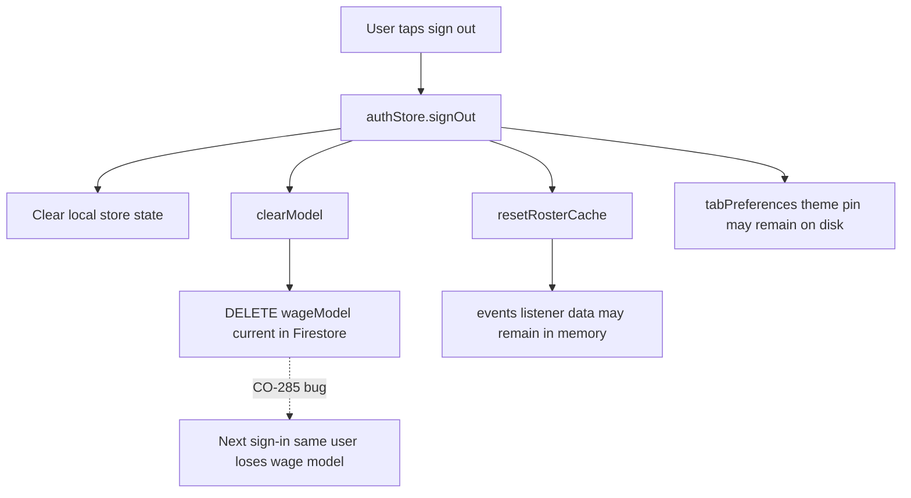

**Expected behaviour (PG-10)**: Sign-out should clear **local** session state only; Firestore remains source of truth for the same user signing back in.

---

## 13. Encryption & security boundaries

| Data class | At rest | In transit | Server sees |
|------------|---------|------------|-------------|
| Wage model fields | AES-GCM via `firestoreEncrypted` | TLS | Ciphertext only |
| Pay record amounts | AES-GCM per field | TLS | Ciphertext only |
| Profile sensitive fields | AES-GCM on user doc | TLS | Ciphertext only |
| Roster patterns | Plaintext in FS | TLS | Plaintext (uid-scoped) |
| Payslip image for OCR | Ephemeral upload | TLS + JWT | **Plaintext to Gemini** — server-side only |
| Backup `.fifoz` | Password-derived key | User-controlled export | Offline file |

**Requirement (ADR-004):** Device secret + uid → encryption key; never send key to backend.

---

## 14. Home dashboard — interface aggregation

`configuredDomains` (`frontend/utils/configuredDomains.ts`) drives **SetupProgressBanner**:

| Domain key | True when | Deep link target |
|------------|-----------|------------------|
| `payModel` | `hourly_rate > 0` **and** `savedInputsHash` set | wages |
| `pay` | Pay snapshot exists in `homeDashboardStore` | wages |
| `profile` | `employment_start_date` or `start_date` on profile | profile / leave |
| `tracker` | `payRecords.length > 0` | paytracker |
| `roster` | `hasConfiguredRoster(calendarStore.rosterPatterns, rosterStore.activePatternId)` | roster |
| `leave` | Leave snapshot exists | leave |
| `goals` | Any goal with `status === 'active'` | goals |

**KPI cards** read `homeDashboardStore` snapshots written by wages, leave, paytracker on successful calculation — not live recalculation on home mount.

**Note**: `roster` domain depends on the **calendar mirror** being populated; cold start before tabs mount may briefly show roster as unconfigured.

---

## 15. Known residual dual paths & technical debt

| Area | Current state | Target state | Ref |
|------|---------------|--------------|-----|
| Sign-out `clearModel` | Deletes FS `wageModel/current` | Local reset only; preserve FS | **CO-285** |
| `calendarStore.events` on sign-out | Not cleared | Unsubscribe + empty array | G-068-08 |
| Persisted tab/theme prefs | Survive sign-out | uid-scoped wipe on shared devices | audit-037 |
| Roster CRUD REST on `calendarStore` | Methods exist; app uses `rosterStore` | Remove or `__DEV__` guard | CO-261 |
| `POST /calculate/wages` | Backend still available | Dev/parity only | task-166 |
| Employment data | API + Firestore subcollection | Client FS CRUD (Phase B) | CO-264 |
| Goals mutations | REST only | Acceptable; listener syncs UI | — |
| PDF OCR upload | JSON base64 from client | Multipart FormData | G-063-04 |
| Health feature | Isolated from roster phase | M16 roster-aware companion | PG-08 |

---

## 16. M16 preview — planned interface extensions

Not implemented (v2.1.0). Documented for design continuity:

| New interface | Connects to | Requirement |
|---------------|-------------|-------------|
| Health check-in store | `rosterStore` phase (R&R vs on-site) | PG-08 (M16) |
| HealthKit / wearables | Premium entitlement | task-153 |
| Mental health module | TGA legal gate | task-151 |
| SANO content API | Health tab articles | Contract 1 Jul 2026 |
| `fifoz_health_pro` entitlement | RevenueCat | task-026 blocker |

---

## 17. Verification matrix (task-177 / device QA)

Cross-interface flows to sign off:

| # | Flow | Interfaces touched | Pass criterion |
|---|------|-------------------|----------------|
| 1 | Cold start → wages | wageModelStore load | Fields restored |
| 2 | Change roster → wages drift banner | rosterStore → wageModelStore | Drift hint or sync |
| 3 | Wages calculate → home KPI | wageModelStore → homeDashboardStore | Pay card updates |
| 4 | Wages → add pay record | prefill utils → financeStore | Estimates populated |
| 5 | OCR payslip | API OCR → createPayRecord | Variance card; record in list |
| 6 | Leave with employment | employment API → leave.ts | Service years correct |
| 7 | Goals affordability | wageModelStore → GoalsAffordabilityBar | Bar reflects net |
| 8 | Sign out → second user | authStore reset | No data bleed; **also**: first user wage model still in FS after CO-285 fix |
| 9 | Offline wages | calculations only | No network required |
| 10 | Staging backend | EXPO_PUBLIC_BACKEND_URL | OCR + employment work |
| 11 | Sign out → same user sign in | wageModelStore | Wage model restored (regression for CO-285) |

**Criteria doc:** [`docs/m15-device-qa-signoff-criteria.md`](../../docs/m15-device-qa-signoff-criteria.md)

---

## 18. File reference index

| Topic | Path |
|-------|------|
| Milestone M15 scope | `agent/milestones/milestone-15-pay-profile-spine.md` |
| M15.1 remediation | `agent/milestones/milestone-15-1-pay-profile-remediation.md` |
| Pre-spine gaps | `agent/reports/audit-046-product-companion-gaps.md` |
| Post-M15.1 audit | `agent/reports/audit-063-m15-1-post-implementation.md` |
| This spec audit (round 2) | `agent/reports/audit-069-design-spec-m15-spine-v2-round2.md` |
| Prior spec audit | `agent/reports/audit-068-design-spec-m15-spine-v2-audit.md` |
| v2 spec (historical) | `agent/reports/design-spec-app-interfaces-m15-spine-v2.md` |
| v1 spec (historical) | `agent/reports/design-spec-app-interfaces-m15-spine.md` |
| Design spec command | `agent/commands/acp.design-spec.md` (`/acp-design-spec`) |
| Firestore collections constant | `frontend/constants/userFirestoreCollections.ts` |
| Spine migration | `frontend/utils/spineMigration.ts` |
| Roster mirror | `frontend/utils/rosterMirror.ts` |
| Configured domains | `frontend/utils/configuredDomains.ts` |
| Tab roster subscription | `frontend/app/(tabs)/_layout.tsx` |
| Auth bootstrap | `frontend/app/_layout.tsx` |
| Backend routes | `backend/server.py` (`api_router`) |
| Staging deploy interfaces | `docs/gcp-staging-cicd-setup.md` |

---

## 19. Mermaid rendering notes

| Cause | Symptom | Fix |
|-------|---------|-----|
| **Invalid Mermaid syntax** | Yellow “Diagram rendering failed” | Avoid `[/api/foo/]` stadium nodes; quote labels with special chars |
| **Narrow DocsViewer column** | Tiny text | Click to zoom; fullscreen; hide TOC |
| **`&quot;` in stored HTML** | Parse failure | Visualizer `fad4492` decodes entities in `extractMermaid` |
| **Stale NodeList after dynamic import** | Silent no render | Visualizer `fad4492` re-queries DOM after `import('mermaid')` |
| **`data-processed` collision** | Mermaid 11 skip | Use `data-mermaid-done` marker (Visualizer ≥ fad4492) |
| **Dev server SIGABRT (exit 134)** | Visualizer crashes on reload | Fixed in Visualizer v1.5.3 (`54659ea`, `d73d242`); see feedback-004 |
| **Cursor / GitHub preview** | Different layout | Prefer ACP Visualizer Docs tab |

**Syntax traps avoided in v2:**

- Stadium shapes with slashes: use `API[OCR endpoint]` not `API[/api/ocr]`
- Arrows to subgraph ids: link concrete nodes
- Unquoted `{uid}` in node labels: use plain text or quotes

---

**Document type:** Detail design / interface specification (v2.1)  
**Maintainer:** Update when M16 interfaces land, CO-285 fixed, or REST paths removed  
**Generated by:** ACP `/acp-audit` #069 (round 2) — subject: app interfaces & M15 spine relationships
