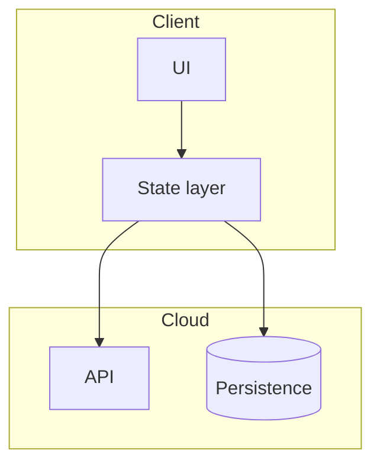
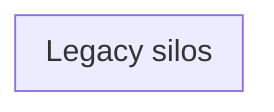
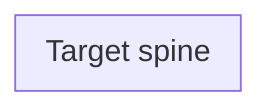
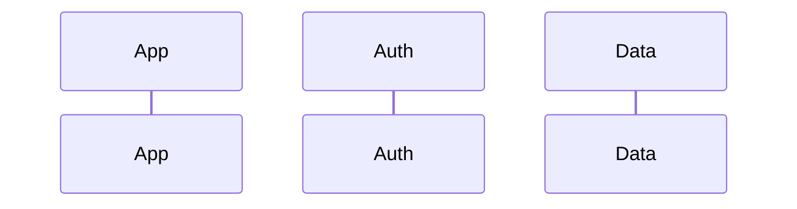

# {PROJECT} — Application Interface & Data-Flow Design Specification (v{N})

**Version**: {N}  
**Generated**: {YYYY-MM-DD}  
**Status**: draft | review | approved  
**Supersedes**: {prior spec path or "—"}  
**Audit**: {audit-NNN or "pending"}  
**App version**: {from package manifest / progress.yaml}  
**Scope**: {one-line scope}  
**Stakeholders**: {developers, QA, security, PM}  
**Related**: {milestones, audits}  
**Audience**: {detail design, QA sign-off, onboarding}  
**Standards mapping**: arc42 §1–8, §11–12; C4 L1–L3; IEEE 1016; ISO 42010; DFD L0–L2  

### Changelog

| Change | Section |
|--------|---------|
| {description} | §{N} |

---

## 1. Executive summary

{Layer table: Screens → State → Persistence → Backend → Platform}

---

## 2. Terminology

| Term | Meaning in this document |
|------|---------------------------|
| **Interface** | {definition} |
| **Source of truth** | {definition} |

---

## 3. System context

### 3.1 Deployment & environments (optional)

| Environment | URL / project | Notes |
|-------------|---------------|-------|

---

## 4. Interface inventory — screens (presentation)

### 4.1 Navigation shell

| Route | Screen | Primary state | Data source |
|-------|--------|---------------|-------------|

### 4.3 Shell patterns (if applicable)

{Tab re-export, nested layout, etc.}

---

## 5. Interface inventory — state stores

### 5.1 Store catalog

| Store | Path | Persistence | Encrypted? | Consumers |
|-------|------|-------------|------------|-----------|

### 5.2 Dual read/write paths (if any)

### 5.3 Cross-store data relationships

---

## 6. Persistence map

| Path / table | Purpose | Writer | Readers |
|--------------|---------|--------|---------|

---

## 7. Backend API catalog & data flows

| Method | Path | Purpose | Auth |
|--------|------|---------|------|

---

## 8. Client calculation engines (omit if N/A)

| Module | Inputs | Outputs | Consumers |
|--------|--------|---------|-----------|

---

## 9. Before-state architecture (omit with --narrow)

### 9.1 Gap register

| ID | Gap | Affected interfaces |
|----|-----|---------------------|

---

## 10. Target-state architecture

### 10.1 Milestone deliverables → interfaces

### 10.2 Remediation / follow-up interface changes

| Task | Interface impact | Status |
|------|------------------|--------|

---

## 11. Requirements traceability

| Req ID | Requirement | Interface(s) | Status | Verification |
|--------|-------------|--------------|--------|--------------|

---

## 12. Bootstrap & session lifecycle

### 12.1 Sign-out data boundary

| Action | Local cleared? | Remote impact |
|--------|--------------|---------------|

---

## 13. Encryption & security boundaries

| Data class | At rest | In transit | Server sees |
|------------|---------|------------|-------------|

---

## 14. Aggregation / composite interfaces (omit if N/A)

---

## 15. Known residual dual paths & technical debt

| Area | Current state | Target state | Ref |
|------|---------------|--------------|-----|

---

## 16. Next scope preview — planned interfaces

| New interface | Connects to | Requirement |
|---------------|-------------|-------------|

---

## 17. Verification matrix

| # | Flow | Interfaces touched | Pass criterion |
|---|------|-------------------|----------------|

---

## 18. File reference index

| Topic | Path |
|-------|------|

---

## 19. Mermaid rendering notes

| Cause | Symptom | Fix |
|-------|---------|-----|

---

**Document type:** Application interface & data-flow design specification  
**Generated by:** ACP `/acp-design-spec`
