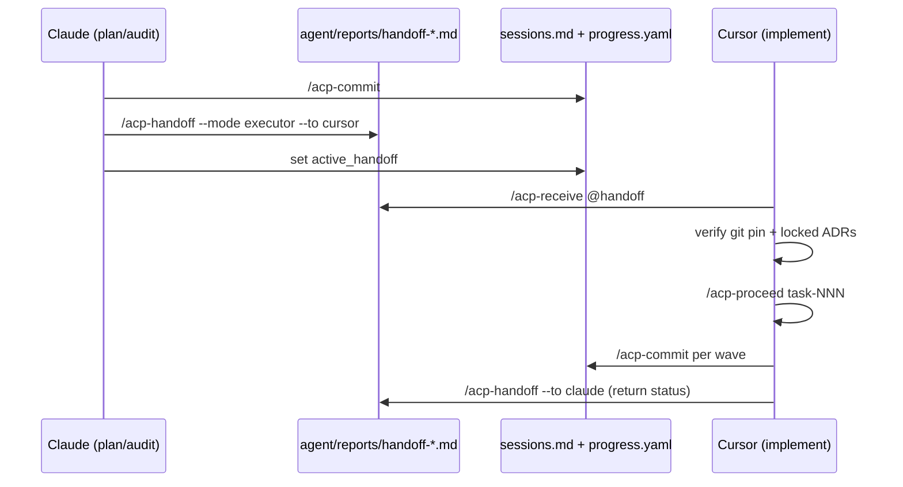

# ACP Enhanced — Cross-Agent Handoff Protocol v1

**Document type:** Enhancement proposal (upstream)  
**Version:** 1.0.0  
**Date:** 2026-07-13  
**Author:** FIFOZ project (field evidence from Claude Code, Claude Fable 5, Cursor Composer 2.5)  
**ACP in use:** Enhanced v2.14.2 (FIFOZ `agent/` layout)  
**Companion audit:** `agent/reports/audit-245-cross-agent-handoff-acp-enhanced.md`  
**Upstream brief:** `agent/feedback/feedback-007-cross-agent-handoff-protocol.md`  
**Submit to:** ACP Enhanced maintainers (same channel as feedback-001…006)

---

## 1. Problem statement

Multi-executor workflows are now normal: **Claude** for planning, audit, and product strategy (Fable); **Cursor** for implementation and device QA. Both operate on the **same repository** with the same `agent/` memory layer, but **different session boundaries**.

The existing `/acp-handoff` command (v1.0.0) assumes:

- Cross-repository context transfer
- Problem + request only — **no implementation steps**
- Chat as primary delivery
- No receiving command, no lifecycle, no git pin validation

FIFOZ evidence (9 handoffs, June–July 2026) shows the highest-value pattern is the **opposite**: same-repo **executor handoffs** with locked ADRs, task sequences, guardrails, and git commit pins — exemplified by M51 (`handoff-cursor-composer25-m51-2026-07-13.md`).

Without framework support, teams reinvent conventions every milestone. Failure modes observed:

| Failure | Cause |
|---------|--------|
| Receiving agent replans instead of implements | No "decisions locked" section in command spec |
| `sessions.md` stale vs handoff | Handoff written without `/acp-commit` chain |
| Wrong git base | No commit pin or freshness check on receive |
| Scope creep | No "What NOT to do" / "Adjacent (out of scope)" sections |
| Planning agent blind after implementation | No return-handoff template |

**This proposal defines Cross-Agent Handoff Protocol v1** so the framework encodes what FIFOZ already does successfully — structurally, not as tribal knowledge.

---

## 2. Goals and non-goals

### Goals

1. **Two explicit handoff modes** with distinct templates and defaults
2. **Bidirectional ritual**: outgoing (`handoff` + `commit`) and incoming (`receive` or `resume`)
3. **Git reproducibility**: branch + commit SHA in every executor handoff; receive-side drift warning
4. **Memory alignment**: handoff references last `sessions.md` entry; commit chain enforced in command text
5. **Round-trip**: return handoff template for implementation → planning agent
6. **Discoverability**: `active_handoff` pointer + optional `HANDOFF-LATEST.md`

### Non-goals (v1)

- Automatic cross-session agent messaging (no transport layer)
- Handoff diff/merge between concurrent handoffs
- Replacing `/acp-report` (session reports remain broader)
- Executor-specific API integrations (Claude Code vs Cursor remain user-pasted `@` files)

---

## 3. Handoff modes

| Mode | CLI | Use when | Default output | Implementation steps? |
|------|-----|----------|----------------|----------------------|
| **Cross-repo** | `--mode cross-repo` (default) | Work in repo A needs change in repo B | User prompted; chat OK | **No** (current behaviour) |
| **Executor** | `--mode executor` | Same repo, different agent/session (plan → implement, implement → audit) | **Disk required** | **Yes** (task IDs, sequence, ADRs) |

### Executor targeting

```
/acp-handoff --mode executor --to cursor
/acp-handoff --mode executor --to claude
/acp-handoff --mode executor --to <executor>   # freeform if not cursor/claude
```

**Filename convention (generated by command):**

```
agent/reports/handoff-{to}-{scope-slug}-{YYYY-MM-DD}.md
```

Examples:

- `handoff-cursor-m51-fifoz-pro-2026-07-13.md`
- `handoff-claude-m51-implementation-status-2026-07-20.md`

---

## 4. Executor handoff template (mandatory sections)

When `--mode executor`, the command **must** populate this structure (agent may add subsections; may not omit headers).

```markdown
---
handoff_version: 1
handoff_mode: executor
from_executor: {claude|cursor|fable|human}
to_executor: {claude|cursor|...}
date: {ISO date}
status: active
supersedes: {path or null}
git_branch: {branch}
git_commit: {full SHA}
git_remote: {url}
app_version: {from identity.yml if present}
---

# Handoff: {title} → {to_executor}

## Model / executor requirements
{If Cursor: Composer 2.5 non-fast, hooks, etc.}

## Start here (receiving agent)
1. Run project context protocol (CLAUDE.md / AGENTS.md Steps 1–6)
2. Run `/acp-receive @this-file` OR verify git_commit matches `git rev-parse HEAD`
3. Read locked decisions — do not re-litigate

## Problem / context
{Why this handoff exists — 1–3 paragraphs}

## Locked decisions (do not re-litigate)
{ADR IDs, stakeholder decisions, audit verdicts}

## Assignment
{Implement | Audit only | Document only — explicit mode}

## Plan reference
- Milestone: {path}
- Tasks: {paths or IDs}
- Sequence: {dependency graph}

## What NOT to do
{Explicit out-of-scope — prevents replanning loops}

## State to update as you work
- `agent/progress.yaml` — {milestone id}
- `agent/memory/audit-carryovers.md` — {CO-xxx}
- `agent/memory/sessions.md` — via `/acp-commit`

## Adjacent context (out of scope for this handoff)
{Links to audits, Fable reviews, partner docs — read for context, do not implement}

## Return handoff (when you finish or block)
Generate: `/acp-handoff --mode executor --to {from_executor}` with:
- Tasks completed / in progress / blocked
- Commits (SHA list)
- HUMAN gates hit
- Questions for planning agent

## Reference chain
{Audit reports, task files, ADRs — table}
```

---

## 5. Cross-repo handoff template (retain, clarify)

Keep current v1.0.0 behaviour with these clarifications:

- Absolute paths from filesystem root
- No task sequences or milestone references unless target repo shares monorepo
- Default: prompt chat vs disk; **recommend disk** if >30 lines

---

## 6. New command: `/acp-receive`

**Purpose:** Receiving-side protocol — load handoff, verify environment, print checklist.

### Arguments

```
/acp-receive
/acp-receive @agent/reports/handoff-cursor-m51-2026-07-13.md
/acp-receive --latest
```

### Steps (agent directive)

1. Resolve handoff path: argument → `--latest` reads `progress.yaml` `active_handoff` → `HANDOFF-LATEST.md` → error
2. Parse YAML frontmatter if present; else scrape `git_commit` / `git_branch` from body
3. Run `git rev-parse HEAD` and `git branch --show-current`; compare to handoff
   - **Match:** proceed
   - **Mismatch:** warn prominently; list commits since pin (`git log pin..HEAD --oneline`)
4. Read last entry from `agent/memory/sessions.md`; compare date to handoff date
   - If handoff newer than last session: warn "run outgoing agent's /acp-commit or note gap"
5. Load `handoff_mode`; if `executor`, print assignment + NOT list + sequence
6. Output one line: `[ACP Receive] handoff loaded | git {match|DRIFT} | mode {executor|cross-repo}`
7. Prompt: "Confirm assignment mode before proceeding."

### Related command update: `/acp-resume`

Add optional first argument: handoff path. If provided, run receive steps 1–6 **then** existing resume steps (core + last session + optional task ID).

---

## 7. Outgoing ritual (enforce in `/acp-handoff` directive)

**Executor mode — mandatory preamble in command:**

```
Before generating an executor handoff:
1. If this session produced memory-worthy work → run /acp-commit first
2. Capture git_branch and git_commit (full SHA)
3. Set progress.yaml active_handoff to output path (see §8)
4. Save to disk (do not default to chat-only)
5. If superseding a prior handoff → set supersedes: and mark old status: superseded in frontmatter
```

**routing.yml chain (already exists — make command reference it):**

```yaml
acp-handoff:
  - acp-commit: "Commit session before handoff"
  - acp-status: "Include status snapshot in handoff body"
```

Remove ambiguity with `/acp-report` — handoff is **narrow transfer**; report is **session summary**.

---

## 8. `progress.yaml` extension

Add optional top-level field (validated by `/acp-validate`):

```yaml
active_handoff:
  path: agent/reports/handoff-cursor-m51-fifoz-pro-2026-07-13.md
  date: "2026-07-13"
  to_executor: cursor
  from_executor: claude
  git_commit: 1b0e520d
  status: active   # active | superseded | completed
```

Handoff command updates this on save. `/acp-receive --latest` reads it.

---

## 9. Return handoff (round-trip)

Executor handoffs **must** include a "Return handoff" section (template §4).

**Return handoff types:**

| Type | `--to` | When |
|------|--------|------|
| Implementation status | `claude` | Milestone wave done or blocked |
| Plan audit request | `claude` | Before large implementation (see M47 pattern) |
| QA / device results | `cursor` | After HUMAN device pass |

**Return template additions** (beyond forward template):

```markdown
## Completed this session
- task-730: {status} — commit {sha}

## Blocked / HUMAN gates
- task-737: claims matrix needs human sign-off

## Git state now
- branch: develop
- HEAD: {sha}
- pushed: yes/no

## Questions for receiving agent
1. ...
```

---

## 10. Command file changes (upstream diff summary)

### `agent/commands/acp.handoff.md`

| Section | Change |
|---------|--------|
| Version | 1.0.0 → 2.0.0 |
| Arguments | Add `--mode executor|cross-repo`, `--to <executor>` |
| Steps | Branch on mode; executor uses template §4 |
| Key design decisions | Remove "implementation steps not included" for executor mode |
| Verification | Add checks for frontmatter, git pin, active_handoff update |

### New: `agent/commands/acp.receive.md`

Full directive per §6.

### `.cursor/skills/acp-resume/SKILL.md`

Add Step 0: optional handoff path → delegate to receive protocol.

### `agent/wiki/` (new page)

`cross-agent-handoff.md` — ritual diagram, mode selection, FIFOZ examples.

### `agent/core/routing.yml`

```yaml
acp-receive:
  - acp-resume: "Continue after receive checklist"
  - acp-proceed: "Start implementation from handoff tasks"
  - acp-status: "Verify git and milestone alignment"

acp-handoff:
  - acp-commit: "Commit session before handoff (required executor mode)"
  - acp-status: "Snapshot for handoff body"
```

---

## 11. Ritual diagram (documentation)



---

## 12. FIFOZ evidence table

| Handoff file | Direction | Pattern quality |
|--------------|-----------|-----------------|
| `handoff-claude-m47-m48-plan-audit-2026-07-12.md` | Cursor → Claude | ★★★★★ Audit assignment |
| `handoff-cursor-composer25-m51-2026-07-13.md` | Claude → Cursor | ★★★★★ Executor implement |
| `handoff-cursor-m47-m50-implementation-2026-07-12.md` | Claude → Cursor | ★★★★☆ Implementation scope |
| `handoff-composer-2.5-m42-2026-07-04.md` | Planning → Cursor | ★★★★☆ |
| `handoff-cursor-composer-2026-07-12.md` | Cross-repo FIFOZ+Boilerplate | ★★★☆☆ Cross-repo (mode A) |

---

## 13. Acceptance criteria (upstream release)

- [ ] `/acp-handoff --mode executor` generates all §4 sections; fails verification if git pin missing
- [ ] `/acp-handoff --mode cross-repo` preserves v1.0.0 behaviour
- [ ] `/acp-receive` warns on git drift and session date gap
- [ ] `active_handoff` written to `progress.yaml` on executor handoff save
- [ ] `/acp-resume @handoff.md` loads receive checklist + last session
- [ ] Wiki page published in ACP Enhanced template repo
- [ ] `.cursor/commands/acp-receive.md` wrapper synced by `acp.sync-cursor-commands.sh`
- [ ] `/acp-validate` optional rule: if `active_handoff.status == active`, file exists and SHA is ancestor of HEAD

---

## 14. Prioritized backlog for ACP Enhanced team

| Priority | Item | Effort |
|----------|------|--------|
| **P0** | `acp.handoff.md` v2 — dual mode + executor template | M |
| **P0** | `acp.receive.md` new command | M |
| **P1** | `acp-resume` handoff path integration | S |
| **P1** | `progress.yaml` `active_handoff` schema + validate | S |
| **P1** | Wiki `cross-agent-handoff.md` | S |
| **P2** | Frontmatter `status: superseded` automation | S |
| **P2** | `HANDOFF-LATEST.md` symlink/copy on save | S |
| **P2** | Git ancestry check in validate | M |

---

## 15. FIFOZ adoption plan (post-upstream)

Until ACP Enhanced ships v2 handoff:

1. Follow this proposal as **project convention** (`agent/wiki/cross-agent-handoff.md` local copy)
2. Use filename convention §3 manually
3. Always `/acp-commit` before executor handoff
4. Receiving session: `@handoff` + manual git pin check
5. Submit `feedback-007` to track upstream

---

## 16. Sign-off

| Role | Name | Date | Status |
|------|------|------|--------|
| FIFOZ engineering | Cursor session | 2026-07-13 | Proposal ready |
| ACP Enhanced team | — | — | Pending review |

---

*This document is the authoritative enhancement spec for Cross-Agent Handoff Protocol v1. Implementation belongs in the ACP Enhanced framework repository; FIFOZ carries field evidence and pilot conventions until merge.*
